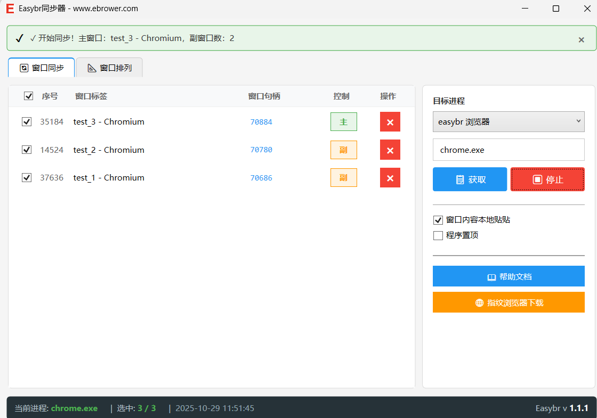
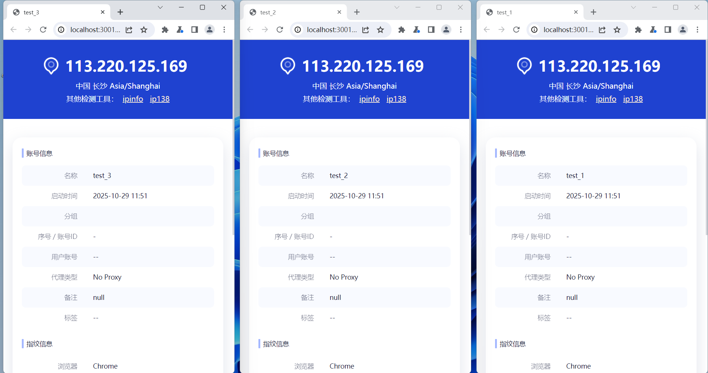

# 🚀 EasyBr Free Window Syncer - Essential Multi-Browser Tool

> **Completely Free** | **Lightweight** | **Powerful** | **Ready to Use**



## 📖 Product Overview

**EasyBr Window Syncer** is a powerful free synchronization tool that not only supports EasyBr fingerprint browser window synchronization but also perfectly supports Notepad, LDPlayer emulator, and various other applications. Easily achieve multi-window operation synchronization and dramatically improve work efficiency. Whether you're in e-commerce operations, social media management, or multi-account operations, this tool will help you work more efficiently!

## ✨ Core Features

### 🆓 **Completely Free**
- No payment required, no usage restrictions
- Ad-free, pure experience
- Continuous free updates and maintenance

### ⚡ **Lightweight & Efficient**
- Program size only **300KB**, instant download
- Extremely low memory usage, no impact on system performance
- Fast startup, ready to use immediately

### 🔧 **Simple & Easy to Use**
- One-click startup, no complex configuration needed
- Clean interface, intuitive operation
- Supports Windows 7/10/11 systems

### 🛡️ **Secure & Reliable**
- Green software, no malicious code
- No collection of user privacy data
- Local operation, data security

## 🎯 Main Features

### 🌐 **EasyBr Browser Synchronization**
- Multi-window synchronization for EasyBr fingerprint browser
- Supports keyboard and mouse operation synchronization
- Customizable synchronization modes



### 📝 **Notepad Synchronization**
- Real-time synchronization of multiple Notepad windows
- Batch text content editing
- Improved document processing efficiency

### 📱 **LDPlayer Emulator Synchronization**
- Multi-emulator window management
- Game operation synchronization
- Batch application operations

### 🔄 **Batch Operations**
- Batch window management
- Unified settings modification
- Improved operation efficiency

### 🎨 **Custom Configuration**
- Flexible synchronization rule settings
- Supports selective synchronization
- Personalized operation experience


## 📥 Download & Installation

### 🔗 **Official Download Link**
```
https://ebrower.com/helperdoc/easybrsyncer.html
```

### 📋 **System Requirements**
- **Operating System**: Windows 7 SP1 or higher
- **Runtime Environment**: Microsoft .NET 8 Desktop Runtime
- **Hardware Configuration**: Any configuration supported

### 🛠️ **Installation Steps**

1. **Download .NET 8 Runtime** (if not installed)
   - Official download: https://dotnet.microsoft.com/download/dotnet/8.0
   - 64-bit system: https://dotnet.microsoft.com/download/dotnet/thank-you/runtime-desktop-8.0.11-windows-x64-installer

2. **Install Runtime Environment**
   - Double-click the installer
   - Follow the prompts to complete installation

3. **Download and Run Syncer**
   - Visit official download page: https://ebrower.com/helperdoc/easybrsyncer.html
   - Download `easybrSyncer.rar` archive
   - Extract and double-click `easybrSyncer.exe`
   - Start using!

## 💡 Use Cases

### 🛒 **E-commerce Operations**
- Simultaneous multi-store management
- Batch product information editing
- Order processing efficiency improvement

### 📱 **Social Media Management**
- Multi-platform account synchronized operations
- Batch content publishing
- Fan interaction management

### 💼 **Office Automation**
- Multi-window data entry
- Batch file processing
- Repetitive task automation

### 🎮 **Gaming Assistance**
- Multi-game window management
- Game operation synchronization
- Enhanced gaming experience

## 🌟 User Reviews

> "After using EasyBr Syncer, my work efficiency increased by 3 times! Free and easy to use, highly recommended!" - E-commerce Operator Wang

> "Great lightweight design, doesn't consume memory, synchronization is very stable." - Social Media Influencer Li

> "Clean interface, simple operation, even beginners can get started quickly." - Office Worker Zhang

## 🔄 Updates & Maintenance

- **Continuous Updates**: Regular new version releases
- **Feature Optimization**: Continuous improvement based on user feedback
- **Technical Support**: Comprehensive help documentation
- **Active Development**: The tool is continuously optimized and iterated
- **User Feedback**: We welcome and value user feedback for improvement

## 📞 Technical Support

- **Official Website**: https://ebrower.com
- **Help Documentation**: https://ebrower.com/helperdoc/easybrsyncer.html
- **Contact Information**: 
  - WeChat: haohaoxuexibbb
  - QQ: 2265436738
- **Issue Reporting**: Please report any issues or suggestions through the above contact methods

## ⚠️ Important Notes

1. **First-time use** requires installation of .NET 8 runtime environment
2. **Firewall prompts** - please select "Allow access"
3. **Antivirus software** may give false positives - please add to whitelist
4. **Green software** - uninstall by simply deleting files

## 🎉 Get Started Now

Still struggling with inefficient multi-window operations? Download **EasyBr Free Window Syncer** now and experience efficient multi-window synchronized operations!

**Free Download**: https://8.haory.top/f71/easybrSyncer.rar

---

> 💡 **Tip**: This software is completely free with no hidden costs. If you have any questions, please contact technical support.

**Tags**: #FreeSoftware #WindowSync #FingerprintBrowser #MultiTool #EfficiencyTool #EasyBr

---

*Last Updated: January 2025*

